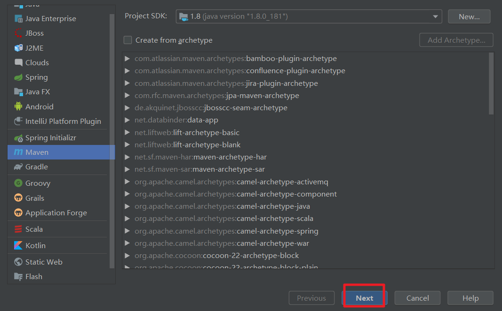
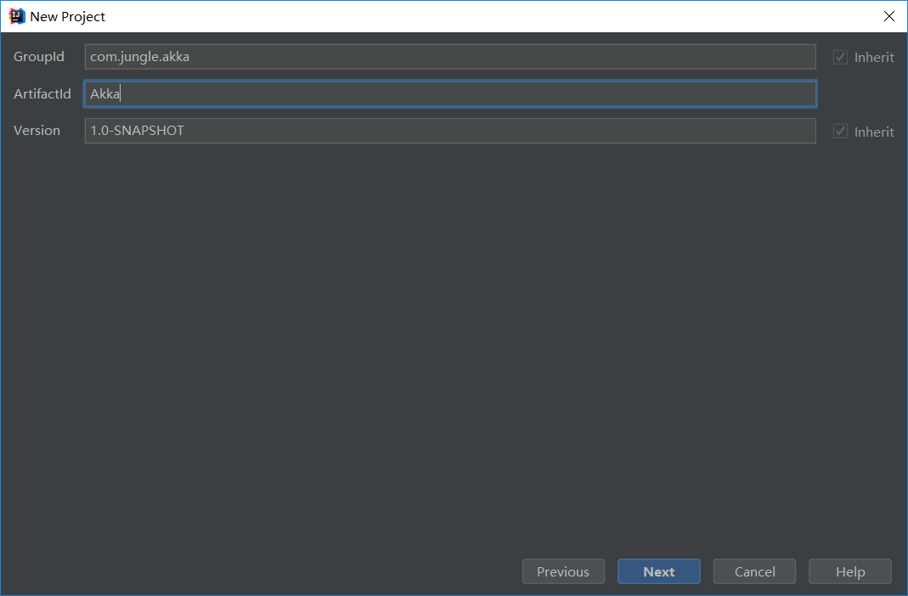
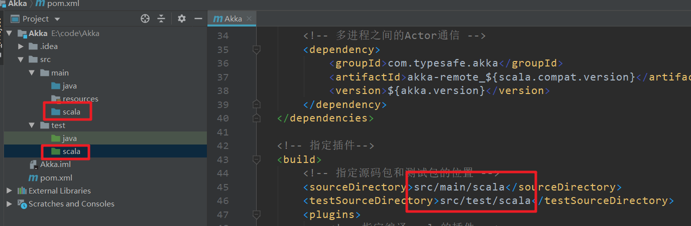
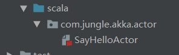
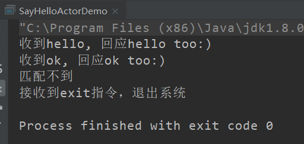
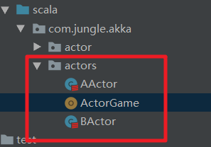
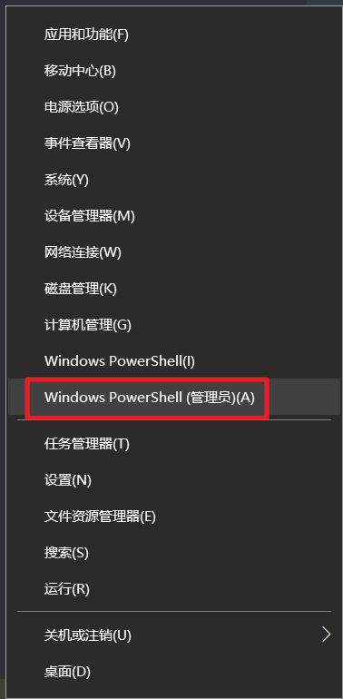
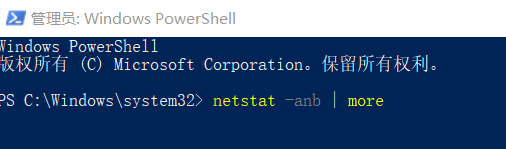
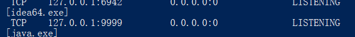
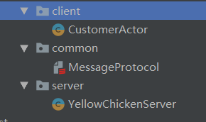

akka

# 一、新建项目





# 二、添加依赖

```xml
 <!-- 定义一下常量 -->
    <properties>
        <encoding>UTF-8</encoding>
        <scala.version>2.11.8</scala.version>
        <scala.compat.version>2.11</scala.compat.version>
        <akka.version>2.4.17</akka.version>
    </properties>

    <dependencies>
        <!-- 添加scala的依赖 -->
        <dependency>
            <groupId>org.scala-lang</groupId>
            <artifactId>scala-library</artifactId>
            <version>${scala.version}</version>
        </dependency>

        <!-- 添加akka的actor依赖 -->
        <dependency>
            <groupId>com.typesafe.akka</groupId>
            <artifactId>akka-actor_${scala.compat.version}</artifactId>
            <version>${akka.version}</version>
        </dependency>

        <!-- 多进程之间的Actor通信 -->
        <dependency>
            <groupId>com.typesafe.akka</groupId>
            <artifactId>akka-remote_${scala.compat.version}</artifactId>
            <version>${akka.version}</version>
        </dependency>
    </dependencies>

    <!-- 指定插件-->
    <build>
        <!-- 指定源码包和测试包的位置 -->
        <sourceDirectory>src/main/scala</sourceDirectory>
        <testSourceDirectory>src/test/scala</testSourceDirectory>
        <plugins>
            <!-- 指定编译scala的插件 -->
            <plugin>
                <groupId>net.alchim31.maven</groupId>
                <artifactId>scala-maven-plugin</artifactId>
                <version>3.2.2</version>
                <executions>
                    <execution>
                        <goals>
                            <goal>compile</goal>
                            <goal>testCompile</goal>
                        </goals>
                        <configuration>
                            <args>
                                <arg>-dependencyfile</arg>
                                <arg>${project.build.directory}/.scala_dependencies</arg>
                            </args>
                        </configuration>
                    </execution>
                </executions>
            </plugin>

            <!-- maven打包的插件 -->
            <plugin>
                <groupId>org.apache.maven.plugins</groupId>
                <artifactId>maven-shade-plugin</artifactId>
                <version>2.4.3</version>
                <executions>
                    <execution>
                        <phase>package</phase>
                        <goals>
                            <goal>shade</goal>
                        </goals>
                        <configuration>
                            <filters>
                                <filter>
                                    <artifact>*:*</artifact>
                                    <excludes>
                                        <exclude>META-INF/*.SF</exclude>
                                        <exclude>META-INF/*.DSA</exclude>
                                        <exclude>META-INF/*.RSA</exclude>
                                    </excludes>
                                </filter>
                            </filters>
                            <transformers>
                                <transformer implementation="org.apache.maven.plugins.shade.resource.AppendingTransformer">
                                    <resource>reference.conf</resource>
                                </transformer>
                                <!-- 指定main方法 -->
                                <transformer implementation="org.apache.maven.plugins.shade.resource.ManifestResourceTransformer">
                                    <mainClass>xxx</mainClass>
                                </transformer>
                            </transformers>
                        </configuration>
                    </execution>
                </executions>
            </plugin>
        </plugins>
    </build>

```

# 三、建scala包



# 四、自我通信



```scala
package com.jungle.akka.actor

import akka.actor.{Actor, ActorRef, ActorSystem, Props}

//说明
//1. 当我们继承Actor后，就是一个Actor,核心方法receive 方法重写
class SayHelloActor extends Actor{
  //说明
  //1. receive方法，会被该Actor的MailBox(实现了Runnable接口)调用
  //2. 当该Actor的MailBox 接收到消息,就会调用 receive
  //3. type Receive = PartialFunction[Any, Unit]
  override def receive:Receive = {
    case "hello" => println("收到hello, 回应hello too:)")
    case "ok" => println("收到ok, 回应ok too:)")
    case "exit" => {
      println("接收到exit指令，退出系统")
      context.stop(self) //停止actoref
      context.system.terminate()//退出actorsystem
    }
    case _ => println("匹配不到")

  }
}

object SayHelloActorDemo {

  //1. 先创建一个ActorSystem, 专门用于创建Actor
  private val actoryFactory = ActorSystem("actoryFactory")
  //2. 创建一个Actor的同时，返回Actor的ActorRef
  //   说明
  //(1) Props[SayHelloActor] 创建了一个 SayHelloActor实例，使用反射
  //(2) "sayHelloActor" 给actor取名
  //(3) sayHelloActorRef: ActorRef 就是 Props[SayHelloActor] 的ActorRef
  //(4) 创建的SayHelloActor 实例被ActorSystme接管
  private val sayHelloActorRef: ActorRef = actoryFactory.actorOf(Props[SayHelloActor],"sayHelloActor")

  def main(args: Array[String]): Unit = {

    //给SayHelloActor 发消息(邮箱)
    sayHelloActorRef ! "hello"
    sayHelloActorRef ! "ok"
    sayHelloActorRef ! "ok~"
    //研究异步如何退出ActorSystem
    sayHelloActorRef ! "exit"

  }

}

```



# 五、Actor间通信



## 1.AActor

```scala
package com.jungle.akka.actors

import akka.actor.{Actor, ActorRef}

class AActor(actorRef: ActorRef) extends Actor {

  val bActorRef: ActorRef = actorRef

  override def receive: Receive = {
    case "start" => {
      println("AActor 出招了 , start ok")
      self ! "我打" //发给自己
    }
    case "我打" => {
      //给BActor 发出消息
      //这里需要持有BActor的引用(BActorRef)
      println("AActor(黄飞鸿) 厉害 看我佛山无影脚")
      Thread.sleep(1000)
      bActorRef ! "我打" //给BActor 发出消息
    }

  }
}

```

## 2.BActor

```scala
package com.jungle.akka.actors

import akka.actor.Actor

class BActor extends Actor{
  override def receive:Receive = {
    case "我打" => {
      println("BActor(乔峰) 挺猛 看我降龙十八掌")
      Thread.sleep(1000)
      //通过sender() 可以获取到发现消息的actor的ref
      sender() ! "我打"
    }
  }
}

```

## 3.ActorGame

```scala
package com.jungle.akka.actors

import akka.actor.{ActorRef, ActorSystem, Props}

//100招后，就退出
object ActorGame extends App {
  //创建ActorSystem
  val actorfactory = ActorSystem("actorfactory")
  //先创建BActor引用/代理
  val bActorRef: ActorRef = actorfactory.actorOf(Props[BActor], "bActor")
  //创建AActor的引用
  val aActorRef: ActorRef = actorfactory.actorOf(Props(new AActor(bActorRef)), "aActor")

  //aActor出招
  aActorRef ! "start"
}

```

# 六、网络编程

## 1.查看端口是否被监听

右击




```
netstat -anb | more
```



​									

## 2.编程



+ YellowChickenServer

  ```scala
  package com.jungle.akka.yellowchicken.server
  
  import akka.actor.{Actor, ActorRef, ActorSystem, Props}
  import com.jungle.akka.yellowchicken.common.{ClientMessage, ServerMessage}
  import com.typesafe.config.ConfigFactory
  
  class YellowChickenServer extends Actor{
    override def receive:Receive = {
      case "start" => println("start 小黄鸡客服开始工作了....")
        //如果接收到ClientMessage
      case ClientMessage(mes) => {
        //使用match --case 匹配(模糊)
        mes match {
          case "大数据学费" => sender() ! ServerMessage("35000RMB")
          case "学校地址" => sender() ! ServerMessage("北京昌平xx路xx大楼")
          case "学习什么技术" => sender() ! ServerMessage("大数据 前端 python")
          case _ => sender() ! ServerMessage("你说的啥子~")
        }
      }
    }
  }
  
  //主程序-入口
  
  object YellowChickenServer extends App {
  
  
    val host = "127.0.0.1" //服务端ip地址
    val port = 9999
    //创建config对象,指定协议类型，监听的ip和端口
    val config = ConfigFactory.parseString(
      s"""
         |akka.actor.provider="akka.remote.RemoteActorRefProvider"
         |akka.remote.netty.tcp.hostname=$host
         |akka.remote.netty.tcp.port=$port
          """.stripMargin)
  
    //创建ActorSystem
    //url (统一资源定位)
    val serverActorSystem = ActorSystem("Server",config)
    //创建YellowChickenServer 的actor和返回actorRef
    val yellowChickenServerRef: ActorRef = serverActorSystem.actorOf(Props[YellowChickenServer],"YellowChickenServer")
  
    //启动
    yellowChickenServerRef ! "start"
  
  
  }
  ```

+ CustomerActor

  ```scala
  package com.jungle.akka.yellowchicken.client
  
  import akka.actor.{Actor, ActorRef, ActorSelection, ActorSystem, Props}
  import com.jungle.akka.yellowchicken.common.{ClientMessage, ServerMessage}
  import com.typesafe.config.ConfigFactory
  
  import scala.io.StdIn
  
  class CustomerActor(serverHost: String, serverPort: Int) extends Actor {
    //定义一个YellowChickenServerRef
    var serverActorRef: ActorSelection = _
  
    //在Actor中有一个方法PreStart方法，他会在actor运行前执行
    //在akka的开发中，通常将初始化的工作，放在preStart方法
    override def preStart(): Unit = {
      println("preStart() 执行")
      serverActorRef = context.actorSelection(s"akka.tcp://Server@${serverHost}:${serverPort}/user/YellowChickenServer")
  
      println("serverActorRef=" + serverActorRef)
    }
  
    override def receive: Receive = {
      case "start" => println("start,客户端运行，可以咨询问题")
      case mes: String => {
        //发给小黄鸡客服
        serverActorRef ! ClientMessage(mes) //使用ClientMessage case class apply
      }
      //如果接收到服务器的回复
      case ServerMessage(mes) => {
        println(s"收到小黄鸡客服(Server): $mes")
      }
  
    }
  }
  
  
  //主程序-入口
  object CustomerActor extends App {
  
    val (clientHost, clientPort, serverHost, serverPort) = ("127.0.0.1", 9990, "127.0.0.1", 9999)
    val config = ConfigFactory.parseString(
      s"""
         |akka.actor.provider="akka.remote.RemoteActorRefProvider"
         |akka.remote.netty.tcp.hostname=$clientHost
         |akka.remote.netty.tcp.port=$clientPort
          """.stripMargin)
  
    //创建ActorSystem
    val clientActorSystem = ActorSystem("client", config)
  
    //创建CustomerActor的实例和引用
    val customerActorRef: ActorRef = clientActorSystem.actorOf(Props(new CustomerActor(serverHost, serverPort)), "CustomerActor")
  
    //启动customerRef/也可以理解启动Actor
    customerActorRef ! "start"
  
    //客户端可以发送消息给服务器
    while (true) {
      println("请输入要咨询的问题")
      val mes = StdIn.readLine()
      customerActorRef ! mes
    }
  
  
  }
  
  ```

+ MessageProtocol

  ```scala
  package com.jungle.akka.yellowchicken.common
  
  //使用样例类来构建协议
  //客户端发给服务器协议(序列化的对象)
  case class ClientMessage(mes: String)
  
  //服务端发给客户端的协议(样例类对象)
  case class ServerMessage(mes: String)
  
  ```

  